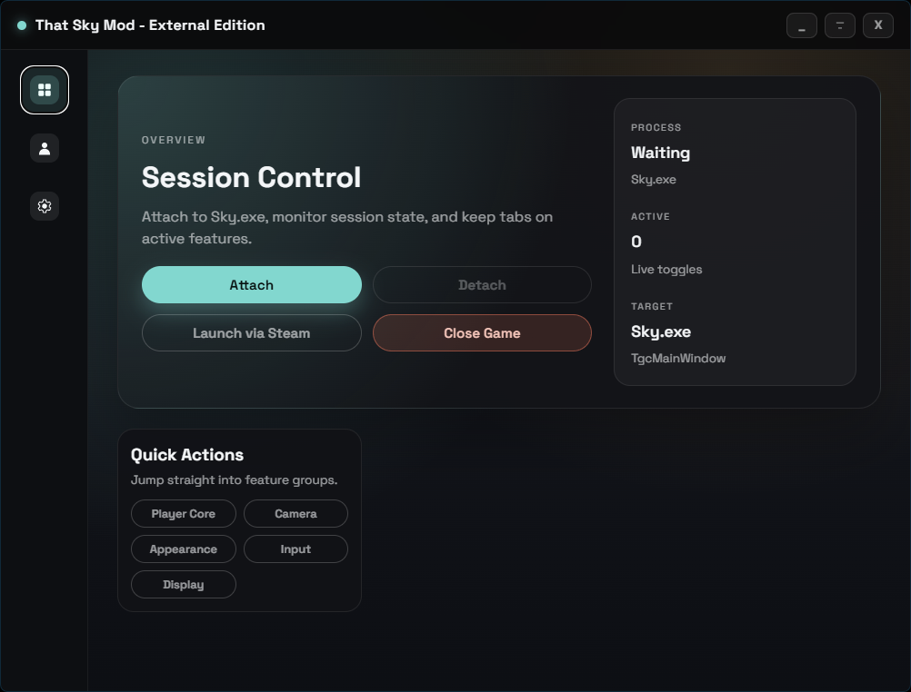

<div align="center">
  <h1>That Sky Mod - External Edition</h1>
  <a href="https://github.com/XeTrinityz/ThatSkyMod-External/releases">
    
  </a>
  <br>
    External variation of That Sky Mod for Sky: Children of the Light, built with Tauri + React. 
    It attaches to `Sky.exe` and provides a clean desktop UI for toggles such as Godmode, Super Flight and more.
  <br>
  <br>
</div>



## Features
- Attach/detach from `Sky.exe` and show session/auth details
- Player, movement, and camera helpers (godmode, infinite energy, super jump, free zoom, and more)
- Global hotkeys, theme presets, always-on-top, scaling, and reduce motion
- Multi-tab UI: Overview, Player, Settings

## Tech Stack
- Tauri v2 + Rust backend
- React + TypeScript + Vite

## Getting Started
```bash
npm install
npm run tauri:dev
```

## Build
```bash
npm run tauri:build
```

## Scripts
- `npm run tauri:dev` - Tauri dev app
- `npm run tauri:build` - Tauri production build

## Project Structure
- `src/` - React UI
- `src-tauri/` - Rust backend and Tauri config
- `public/` - Static assets
- `dist/` - Frontend build output

---
This project is not affiliated with thatgamecompany (TGC) or Sky: Children of the Light.
